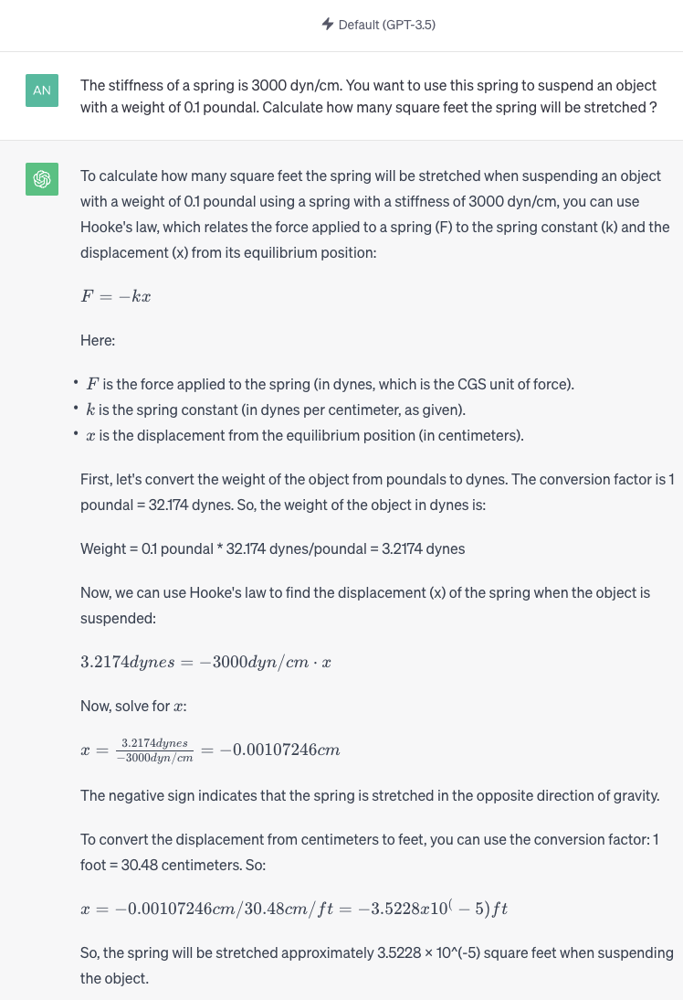

# DimensionPerception

Resources for Paper :  Enhancing Quantitative Reasoning Skills of Large Language Models through Dimension Perception

# Motivation Example

The Figure below is a screenshot that ChatGPT incorrectly answers in our motivation example. In this screenshot, ChatGPT (October 31, 2023) failed to identify the incorrect units in the question due to a lack of understanding of dimensional concepts, leading to erroneous inferences.



# DimUnitKB

`DimUnitKB.csv`: Our Dimensional Unit Knowledge Base, including 1700+ units with their basic information.

Each data entry in the dataset is a CSV row containing the following fields:

* `unit_id`: A unique identifier for the unit
* `label_zh`: The standard name of the unit in Chinese.
* `label_en`: The standard name of the unit in English.
* `symbol`: The symbolic expression of the unit.
* `alias`: The alternative expressions of the unit in all forms.
* `quantitykind`: The type of quantity represented by this unit.
* `dimensionVec`: The dimension of the unit in vector form.
* `basicUnit`: The standard unit corresponding to this unit.
* `conversionVal`: The converted value to the standard unit.
* `frequency`: The frequency of the unit occurrence in texts.
* `keywords_zh`: Desciptive keywords for the unit in Chinese.
* `description_zh`: A descriptive text for the unit in Chinese.
* `description_en`: Desciptive keywords for the unit in English.
* `informativeReference`: The source of information for this unit.

**Example Data Row**

```json
{
  "unit_id": "A",
  "label_zh": "安",
  "label_en": "Ampere",
  "symbol": "A",
  "alias": "安",
  "quantitykind": ["CurrentLinkage",
		   "DisplacementCurrent",
 		   "ElectricCurrent",
		   "ElectricCurrentPhasor",
		   "MagneticTension",
		   "MagnetomotiveForce",
		   "TotalCurrent"],
  "dimensionVec": "A0E1L0I0M0H0T0D0",
  "conversionVal": 1.0,
  "basicUnit": "A",
  "frequency": 68.79,
  "keywords_zh": ["电流", "电阻", "电能"],
  "description_zh": "安培是国际制单位制中的基本单位之一，用于测量电流强度。一个安培被定义为一秒钟内通过导体横截面的电荷量，是电学中十分重要的单位之一。",
  "description_en": "The  (ampere), often shortened to (amp), is the SI unit of electric current and is one of the seven SI base units.",
  "informativeReference": ["http://en.wikipedia.org/wiki/Ampere?oldid=494026699",
			   "http://baike.baidu.com/subview/4504/5237142.htm"]
}
```

# Dimension Perception

In order to better showcase our seven dimension perception tasks across the three levels, we have provided a subset of the evaluation dataset. The path is located at `/data/Dimperc/*_subtest.json`.

Our dimension perception tasks across the three levels are as follows:

* Basic Perception: Used for evaluating and enhancing the model's basic understanding of quantities, including the recognition of numbers and the awareness of basic knowledge about units within quantities.
* Dimension Perception：Utilized for evaluating and improving the model's higher-level cognition of quantities (centered around dimensional concepts), including comparative analysis, prediction, and calculations involving dimensions. This helps to determine whether the model has grasped the principles of dimensional analysis.
* Scale Perception: Used for evaluating and enhancing the model's ability to comprehend the scale of quantities, including understanding the magnitudes of units within quantities and recognizing unit conversion relationships.

# Quantitative Reasoning

We utilize quantity-dense math word problems (Q-MWP) to assess the quantitative reasoning abilities of language models . To better illustrate the Q-MWP task we have introduced, we provide an extended evaluation subset on the Ape210k dataset. The path is located at `/data/QuantitativeReasoning/*_subtest.json`.

# Environment Installtion

```
conda create -n dimperc python==3.10
conda activate dimperc

pip install -r requirements.txt

pip install -e .
```

# Code for Finetuning

We finetune Llama base model using the **Dimperc** dataset and the **Q-MWP** dataset to inject dimensional knowledge into it.

Convert the training data into a more efficient `.pkl` format.

Navigate to the `/code/finetune/` directory.

```
cd /code/finetune
```

Modify the configurations in `/code/finetune/config/`, including the base model, data_path, and so on. Then, generate the ids data for finetuning.

```
python convert_data.py /path/to/config.json
```

Then, finetune the model.

```
RUN_NAME="dimperc_finetune"
DS_PORT=12310
GPU_LIST="localhost:0,1,2,3"

deepspeed --master_port $DS_PORT --include $GPU_LIST  train.py --train_config /path/to/config.json
```
